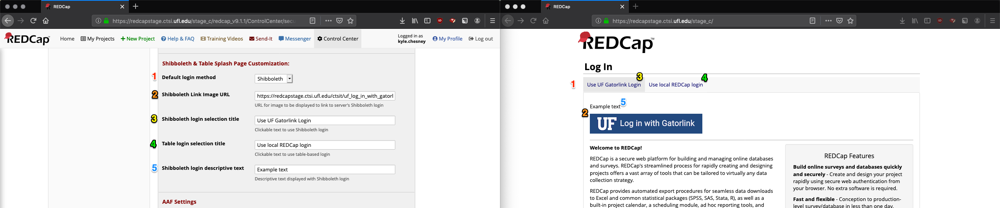

# Shibboleth and table authentication for REDCap

This repository provides a patch to Vanderbilt University's REDCap to allow Shibboleth and table-based authentication at the same time.

# Overview
This tool reads the contents of a REDCap zip file (referred to throughout this document as `redcapN.M.O.zip`, `N.M.O` being the redcap version number) and patches it to add the ability to simultaneously support Shibboleth and table-based users. Shibboleth users who do not already exist in REDCap will be prompted to create an account and will be able to log in after as is the normal behavior with the Shibboleth authentication. Table based users can be created via the Control Center as is normal in table-based authentication.

# Requirements

The patch file requires these resources:

* A REDCap zip file downloaded from Vanderbilt's community web site.
* Access to a terminal with a bash shell and basic gnu utilities to run the `apply_patch` script.

# Instructions
Visit `https://github.com/ctsit/uf_redcap_shibboleth_config/releases` to download the latest release version of this repository. 

Download a redcap zip file, e.g. from the [REDCap community site](https://community.projectredcap.org/page/download.html). This tool works on both the "Install" zip files and the "Upgrade" zip files. Copy your redcap zip file into the root directory of this repository.

Run the following command:

```bash
bash apply_patch.sh redcapN.M.O.zip
```

The program will report if the patch worked or if there was an issue. Once finished, if the program was successful, the `output/redcapN.M.O.zip` file will contain a patched version of the REDCap zip file  needed to enable the use of Shibboleth and Table login functionality.

If you experience an error or even a warning during the patching process, please report it as a new issue in Github. The issue list for this repo is at `https://github.com/ctsit/shibboleth_and_table_auth/issues`. Please include the text of the error or warning and the version of REDCap you were trying to patch.

Note: As of release 9.3.0-1, `apply_patch.sh` can no longer patch REDCaps below 9.3.0.


## Configure Shibboleth

This login method needs to allow Shibboleth login but not _require_ it. Sample Apache directives for configuring your REDCap instance are available in [shib\_table\_auth.conf](shib_table_auth.conf). You will need to customize those directives for your site. Basic instructions for doing that are in the file.

## First time for this REDCap version

If you are launching this version of REDCap for the first time, use the zip file to launch your REDCap site as you normally would.

## Apply the patch without upgrading REDCap

If you currently have this version of REDCap running and want to add Shibboleth and Table functionality to it, you will need to overwrite your existing files with the updated ones. All of the changed files are in the `redcap/redcap_vN.M.O/` folder.

## After your REDCap is launched or updated

You will need to update REDCap's MySQL database if you want to support the new customization fields. A SQL script has been provided for this at `shib_table_sql/`. Use the lastest *.SQL file in that folder. This file will need to be applied to your REDCap server's database. Use whatever method suits you to apply these changes.

# Usage

After the patch has been applied and the database has been updated, on your REDCap site, navigate to Control Center > Security & Authentication. The Authentication Method dropdown menu will have a new entry, `Shibboleth & Table-based`, select it.


Scroll further down on the same page to a section titled `Additional Shibboleth Authentication Settings`, this section  will control the functionality of both Shibboleth and Shibboleth & Table options, the section below controls the login page presented while using Shibboleth and Table option.


**Shibboleth Username Login Field**: The value that is provided by the server containing your Shibboleth login ID. If your institution does not use one of the values in the dropdown menu, select `other` and a text box will appear allowing you to enter the correct value. Make sure this string matches the value that has the username on your system. If your custom value is not found by the web server at login time, the web server will use whatever value Shibboleth has been configured to use as the username field. 

**URL for Shibboleth Logout Page**: This should be set to `/Shibboleth.sso/Logout`. This will redirect users to the server's Shibboleth logout page. You can add [parameters to alter its behavior](https://wiki.shibboleth.net/confluence/display/SHIB2/NativeSPLogoutInitiator). In this example, `return=/stage_c/` redirects users to the path `/stage_c/` on the host after shibboleth logout. The `return` parameter can be useful if your REDCap is not installed at the host's web root.



1. **Default login method**: Controls which login option users are first presented with upon navigating to your REDCap website. `Table-Based` or one of the IdP logins (referred to by title).
2. **Table login selection title**: Controls the text displayed in the tab used to display the table-based login.
3. **Shibboleth login selection title**: Controls the text displayed in the tab used to display a Shibboleth login.
4. **Shibboleth login descriptive text**: Controls optional text to be displayed above a Shibboleth login button.
5. **Shibboleth Link Image URL**: Controls the image presented to users in the button for a Shibboleth login.
    - Note: if using an image hosted on your REDCap server, you may path it relative to your `webroot` rather than via `https://...`.
6. **URL for Shibboleth IdP**: Controls the URL used for Shibboleth authentication.
    - This field should only be used if you need to support multiple IdPs. If you are unsure, leave this blank and it will be set to your server's default IdP.
7. **Additional IdP Logins**: Additional IdP options may be added, the fields are the same as 3-6. See the section below for further discussion of multiple IdPs.

## Support for Multiple IdPs

If you are hosting a REDCap instance used by multiple institutions which support Shibboleth authentication, you may wish to allow users to access REDCap via their respective institution's familiar login process; this can be accomplished by adding each institution as an additional **Id**entity **P**rovider. Additional IdPs must also be configured on your server at `/etc/shibboleth/shibboleth2.xml`. The process of adding multiple IdPs to your Shibboleth Service Provider is beyond the scope of this document.

At the end of the options for your final IdP you will see a button labeled "Add IdP", clicking this will create a new set of fields for you to enter information for an additional IdP. If you only had one IdP before clicking this button, a button labelled "Delete This IdP" will appear.  
At the end of the options for your final IdP, you will see a button labeled "Add IdP". Clicking this will create a new set of fields for you to enter information for an additional IdP. 

In a multi-IdP configuration, each IdP section will show a "Delete This IdP". Note that if you delete the final IdP login, you will be unable to add additional IdPs until you have refreshed the page. 

Adding or deleting IdP logins will not be permanent until you scroll to the bottom and click "Save Changes", after which tabs for each IdP that is filled in will appear on the login page in the order they were entered on the "Security & Authentication" page.

